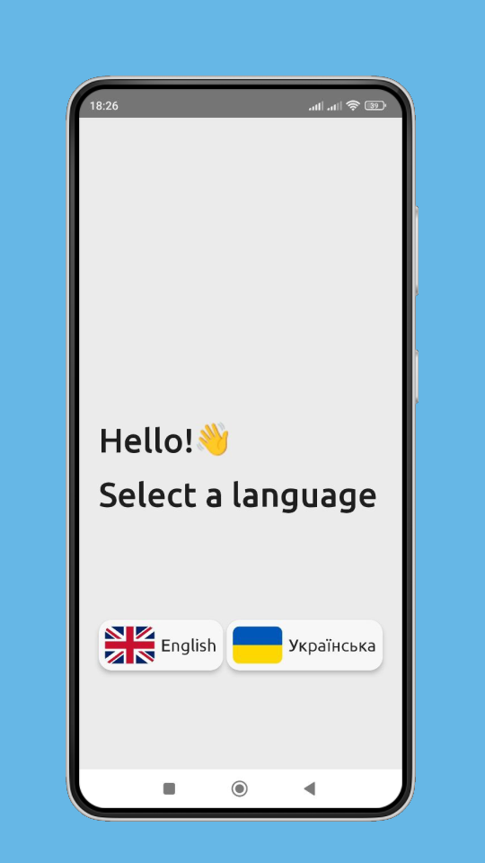
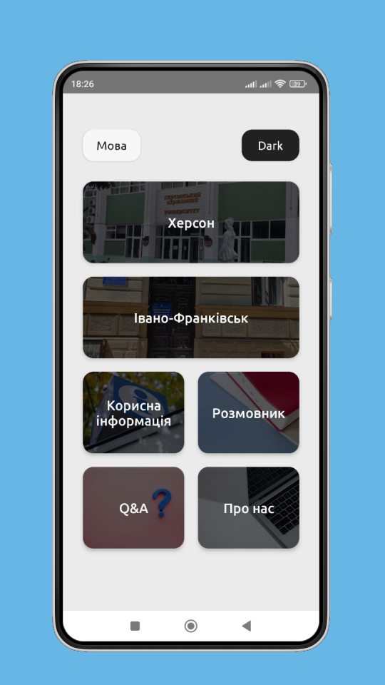
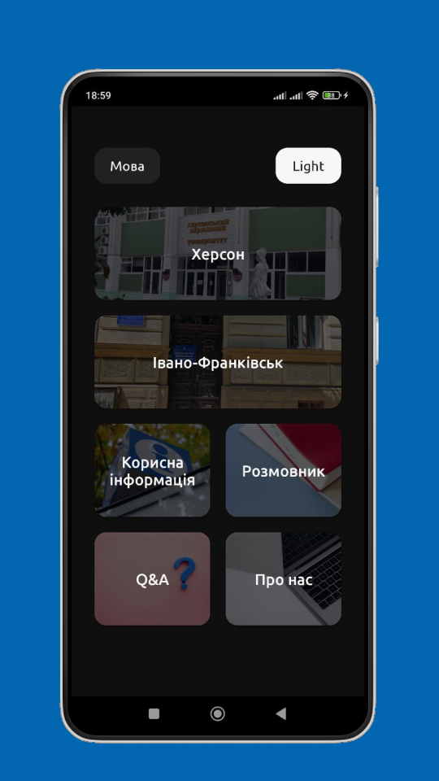
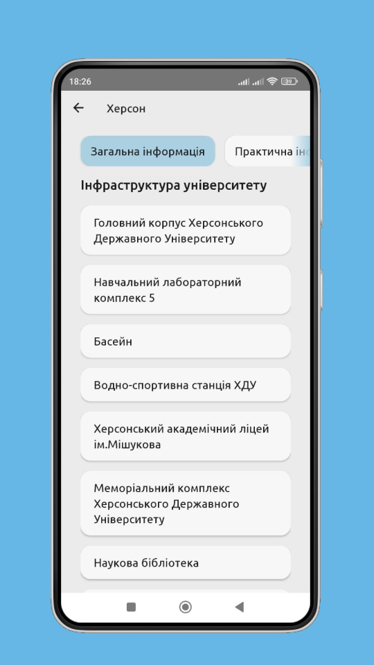
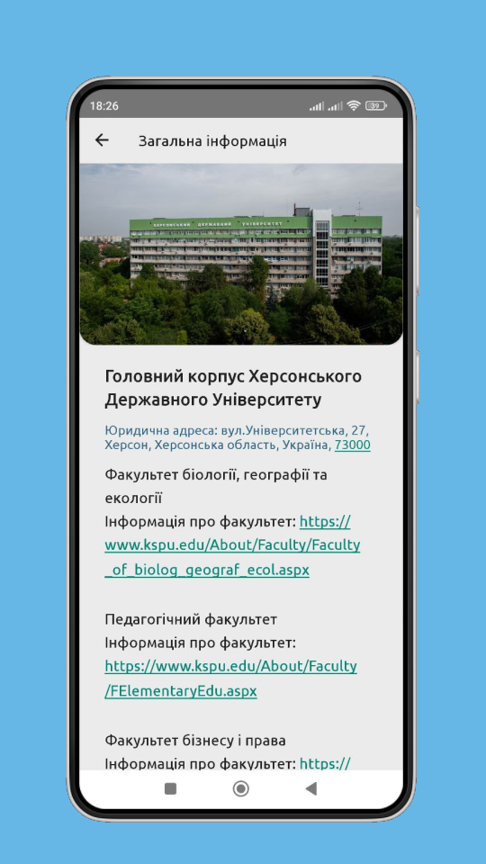
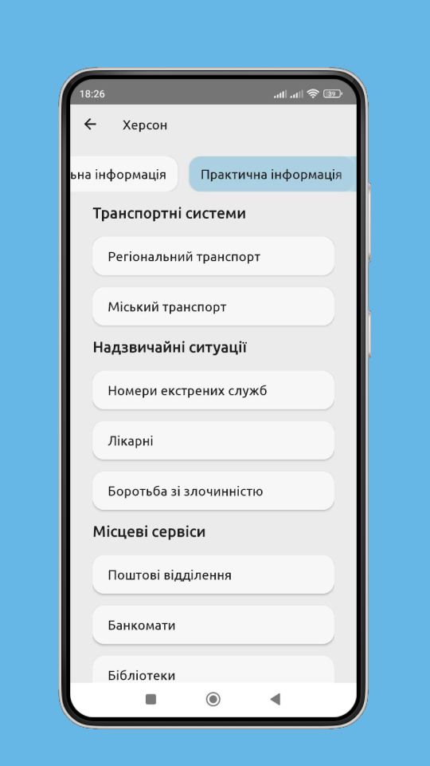
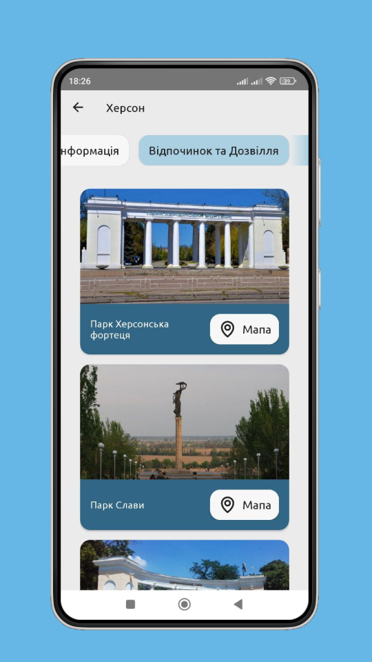
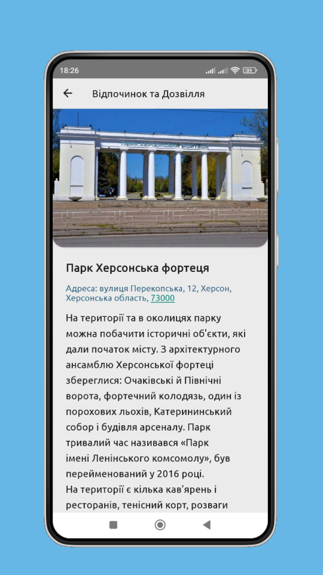

# 📱 Портфоліо Android-розробника | Одеса, Україна

## Проєкти

###  KSU Companion (Student Guide)

**Опис:** KSU Companion — мобільний довідник для студентів університету. В додатку знаходиться актуальна інформація про навчальний процес, адміністративні послуги та інші аспекти про Херсонський Державний Університет.
 
- Реалізовано: мультимовність, RecyclerView, фрагменти  
- Стек: Java, Retrofit, Gson, MySQL, Spring Boot, SnapAdmin

 
 
 
 
 
 
 
 
 

# Контакти:

- **Місто:** Одеса, Україна
- **Telegram:** [@nova_Diva](https://t.me/nova_Diva)
